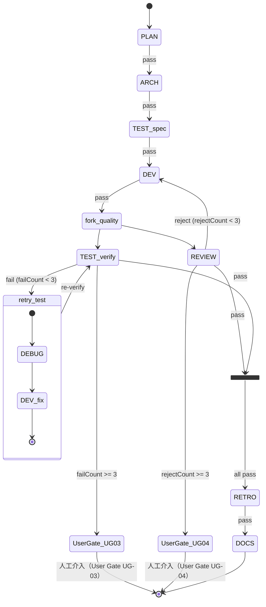

# Overtone 控制流決策點索引

> 本文件為 Overtone 系統中所有控制流決策點的結構化索引，讓開發者在 30 秒內找到任意「誰決定了什麼、在哪裡決定」的答案。
> 涵蓋五個維度：User Gate（人工介入點）、自動決策（hook 自動判斷）、Stage 轉場摘要、Standard Workflow 狀態圖、快速查找索引。
>
> **版本**：v1.0 | **建立日期**：2026-03-05 | **Last Verified**：2026-03-05（對照 session-stop-handler.js、pre-task-handler.js、agent-stop-handler.js、registry.js 原始碼）

---

## 一、User Gate 索引

> 人工介入點 — 系統何時暫停並詢問使用者

---

#### UG-01：Discovery 模式使用者確認

- **觸發條件**：`discovery` workflow 的 PM stage 完成（product-manager agent 輸出分析結果後）
- **觸發時機**：PM stage pass → Main Agent 在 SubagentStop 之後讀取 pm SKILL.md，執行 Discovery 後續流程
- **呈現方式**：AskUserQuestion 多選項
- **Handler 位置**：`~/.claude/skills/pm/SKILL.md` L84-98（Discovery 模式導流規則）
- **使用者看到的選項**：
  - 各建議方案（每個方案附 workflow 類型 + 簡述會做什麼）
  - 「繼續討論」（回到 PM 深入探索）
  - 「寫入佇列但不執行」（規劃模式，不立即啟動 workflow）
- **Decision tree**：
  ```
  IF discovery workflow + PM stage pass
    → AskUserQuestion（使用者選擇方向）
      IF 選擇某方案 → 寫佇列 + 啟動對應 workflow
      IF 繼續討論 → 回到 PM 對話
      IF 寫入佇列但不執行 → queue append --no-auto + 停止
  注意：NEVER 在使用者確認前自動寫入佇列或啟動 workflow
  ```

---

#### UG-02：規劃模式（`/pm plan`）佇列確認

- **觸發條件**：`/pm` 指令的 ARGUMENTS 包含 `plan` 關鍵字
- **觸發時機**：Main Agent 解析 `/pm` 指令時，偵測到 `plan` 關鍵字
- **呈現方式**：停止（非 AskUserQuestion）— PM 分析完成後寫佇列並停止，等待使用者手動啟動
- **Handler 位置**：`~/.claude/skills/pm/SKILL.md` L108-115（規劃模式導流規則）
- **使用者看到的選項**：無互動選項；PM 輸出「已加入佇列」訊息後停止
  - 使用者可用 `bun scripts/queue.js list` 查看
  - 使用者可用 `bun scripts/queue.js enable-auto` 啟動自動執行
- **Decision tree**：
  ```
  IF /pm arguments 含 "plan"
    → PM 分析完成
    → bun queue.js append --no-auto（寫佇列，不啟動）
    → 輸出「已加入佇列」訊息
    → 停止，等待使用者手動介入
  ```

---

#### UG-03：TEST FAIL 達到重試上限

- **觸發條件**：`failCount >= 3`（workflow state 累積失敗次數）
- **觸發時機**：tester agent 第 3 次回報 FAIL，agent-stop-handler 遞增 failCount 並標記 stage 為 fail，session-stop-handler 在下一輪 loop 計算 allCompleted + hasFailedStage 時走 abort 分支
- **呈現方式**：停止 Loop，顯示錯誤摘要並等待人工處理（非 AskUserQuestion）
- **Handler 位置**：`~/.claude/skills/workflow-core/references/failure-handling.md` L30-48（TEST FAIL 重試上限規則）
- **使用者看到的選項**：無互動選項；停止後使用者需自行介入
  - 建議步驟：檢查失敗測試是否合理 → 手動分析根因 → 調整測試或程式碼後重新啟動
- **Decision tree**：
  ```
  IF tester FAIL
    IF failCount < 3
      → debugger（診斷根因）→ developer（修復）→ tester（重驗）→ 繼續迴圈
    IF failCount >= 3
      → 停止 Loop（workflow abort）
      → 顯示失敗摘要（每次失敗原因）
      → 等待人工介入
  ```

---

#### UG-04：REVIEW REJECT 達到重試上限

- **觸發條件**：`rejectCount >= 3`（workflow state 累積 reject 次數）
- **觸發時機**：code-reviewer agent 第 3 次回報 REJECT，agent-stop-handler 遞增 rejectCount 並標記 stage 為 reject，session-stop-handler 在下一輪 loop 計算 allCompleted + hasFailedStage 時走 abort 分支
- **呈現方式**：停止 Loop，顯示錯誤摘要並等待人工處理（非 AskUserQuestion）
- **Handler 位置**：`~/.claude/skills/workflow-core/references/failure-handling.md` L70-74（REVIEW REJECT 重試上限規則）
- **使用者看到的選項**：無互動選項；停止後使用者需自行介入
- **Decision tree**：
  ```
  IF code-reviewer REJECT
    IF rejectCount < 3
      → developer（帶 reject 原因修復）→ code-reviewer（再審）→ 繼續迴圈
    IF rejectCount >= 3
      → 停止 Loop（workflow abort）
      → 顯示 reject 摘要
      → 等待人工介入
  ```

---

#### UG-05：RETRO ISSUES 達到迭代上限

- **觸發條件**：`retroCount >= 3`（workflow state 累積回顧迭代次數）
- **觸發時機**：retrospective agent 第 3 次回報 ISSUES 時，Main Agent 評估 retroCount >= 3
- **呈現方式**：停止 RETRO 迭代（非完全停止 — 不同於 UG-03/04），繼續完成剩餘 stages（如 DOCS）
- **Handler 位置**：`~/.claude/skills/workflow-core/references/failure-handling.md` L119-125（RETRO ISSUES 上限規則）
- **使用者看到的選項**：無互動選項；系統自動繼續執行後續 stages
- **Decision tree**：
  ```
  IF retrospective ISSUES
    IF retroCount < 3
      → developer（修復建議）→ [REVIEW + TEST] → retrospective（再回顧）→ 繼續迭代
    IF retroCount >= 3
      → 停止迭代（不再觸發修復迴圈）
      → 繼續完成剩餘 stages（如 DOCS）
      → workflow 正常完成（不 abort）
  注意：與 UG-03/04 不同，RETRO 上限不會 abort workflow
  ```

---

## 二、自動決策索引

> hook 自動判斷 — 無需使用者介入

---

### 2.1 PreToolUse(Task) 決策

> 來源：`~/.claude/scripts/lib/pre-task-handler.js` L73-422

| 決策點 | 條件 | 結果 | Handler |
|--------|------|------|---------|
| 無 session | sessionId 為空 | 放行（result: ''） | pre-task-handler.js L82-84 |
| 無 workflow state | readState 回傳 null | 放行（result: ''） | pre-task-handler.js L86-89 |
| 無法辨識目標 agent | identifyAgent 無法匹配 subagent_type | 放行（result: ''） | pre-task-handler.js L130-133 |
| 目標 stage 找不到 | getStageByAgent 回傳 null | 放行（result: ''） | pre-task-handler.js L138-140 |
| 跳過必要前置階段 | targetIdx 之前存在 status === 'pending' 的 stage | **deny（阻擋委派）** | pre-task-handler.js L151-172 |
| 通過所有檢查 | 無被跳過的前置階段 | allow + updatedInput（注入 workflow context + skill + gap + globalObs + score + failureWarning + testIndex） | pre-task-handler.js L174-418 |

**阻擋訊息格式**：
```
⛔ 不可跳過必要階段！
目標：{emoji} {label}
尚未完成的前置階段：
  - {emoji} {label}（{key}）
請先完成前置階段再繼續。
```

**updatedInput 注入順序**（L371-402）：
`[PARALLEL INSTANCE]` → workflowContext → skillContext → gapWarnings → globalObs → scoreContext → failureWarning → testIndex → originalPrompt

---

### 2.2 SubagentStop 收斂決策

> 來源：`~/.claude/scripts/lib/agent-stop-handler.js` L100-138

| 決策點 | 條件 | 結果 | Handler |
|--------|------|------|---------|
| 無 session 或無 agent 名稱 | sessionId / agentName 為空 | 靜默退出（result: ''） | agent-stop-handler.js L46-49 |
| 無法識別 stage | getStageByAgent 回傳 null | 靜默退出 | agent-stop-handler.js L52-55 |
| 無 workflow state | readState 回傳 null | 靜默退出 | agent-stop-handler.js L57-60 |
| 無法找到 actualStageKey | findActualStageKey 回傳 null | 靜默退出（activeAgents 已清理） | agent-stop-handler.js L96-98 |
| stage 已 completed | entry.status === 'completed'（並行先行 agent 已收斂） | 只遞增 parallelDone，不重複標記 | agent-stop-handler.js L108-112 |
| fail 或 reject | result.verdict === 'fail' 或 'reject' | 立即標記 stage fail/reject，推進 currentStage | agent-stop-handler.js L118-124 |
| 全部 pass 且已收斂 | checkSameStageConvergence(entry) === true | 標記 stage pass，推進 currentStage | agent-stop-handler.js L125-131 |
| pass 但未收斂（並行） | parallelDone < parallelTotal | stage 維持 active，不跳轉 currentStage | agent-stop-handler.js L133 |
| PM stage pass | stageKey === 'PM' && finalResult === 'pass' | 自動解析輸出的佇列表格 → 寫入 execution-queue | agent-stop-handler.js L178-187 |

**fail/reject 遞增規則**（L136-138）：
- `result.verdict === 'fail'` → `failCount + 1`
- `result.verdict === 'reject'` → `rejectCount + 1`

---

### 2.3 Stop hook 退出決策

> 來源：`~/.claude/scripts/lib/session-stop-handler.js` L149-271
> 優先順序：依照 if 判斷執行順序，先命中者優先

| 優先順序 | 條件 | 結果 | 程式碼位置 |
|---------|------|------|-----------|
| 1 | `loopState.stopped === true`（/stop 手動退出） | exit — 停止 Loop，輸出「Loop 已手動停止」 | L152-155 |
| 2 | `loopState.iteration >= 100`（最大迭代） | exit — 停止，輸出達到最大迭代次數警告 | L158-162 |
| 3 | `loopState.consecutiveErrors >= 3`（連續錯誤） | exit — 停止，輸出連續錯誤警告 | L165-169 |
| 4 | `allCompleted && hasFailedStage`（含失敗 stage） | exit（abort）— emit workflow:abort，停止 | L173-181 |
| 5 | `allCompleted && !hasFailedStage`（正常完成） | exit（complete）— emit workflow:complete，觸發佇列邏輯（見 2.4） | L182-220 |
| 6 | `nextStage === 'PM'`（PM 互動模式） | 不阻擋 — 讓 Main Agent 與使用者互動，不強制 loop | L227-240 |
| 7 | 其他（workflow 未完成） | `decision: 'block'`（loop 繼續）— 遞增 iteration，回傳繼續 prompt | L243-272 |

**前置計算**（在退出條件之前，每次都執行）：
- Specs 自動歸檔：allCompleted + !hasFailedStage + featureName → archiveFeature（L72-95）
- 掃描式歸檔 fallback：掃描 in-progress 下 checkbox 全勾選的 feature（L97-108）
- 佇列 completeCurrent：allCompleted + !hasFailedStage → executionQueue.completeCurrent（L120-147）

---

### 2.4 佇列控制流

> 來源：`~/.claude/scripts/lib/agent-stop-handler.js` L177-187 + `~/.claude/scripts/lib/session-stop-handler.js` L193-220

**前置步驟（PM stage 完成時）**：

PM agent 輸出包含執行佇列表格時，agent-stop-handler 在 stage:complete 之後自動解析並寫入 execution-queue：

```
PM stage pass
  → _parseQueueTable(agentOutput)（搜尋「執行佇列」區塊，解析 Markdown 表格）
  → executionQueue.writeQueue(projectRoot, items, source)
  → timeline.emit('queue:auto-write', { count, source: 'PM' })
```

位置：`agent-stop-handler.js` L178-187

**主流程（workflow 完成後）**：

| 條件 | 動作 | 結果 |
|------|------|------|
| allCompleted + !hasFailedStage + completeCurrent 成功（queueCompleted = true） | executionQueue.getNext(projectRoot) | 查詢是否有下一個佇列項目 |
| getNext 有結果（next !== null） | decision: 'block' — 強制 loop 繼續，reason 含「佇列下一項」提示 | Loop 不退出，Main Agent 繼續執行下一個 workflow |
| getNext 無結果 | 正常退出（result: summary） | Loop 退出，工作流完成 |

**`completeCurrent` 詳細邏輯**（session-stop-handler.js L120-147）：
1. `executionQueue.completeCurrent(projectRoot)` — 標記 in_progress 項目為 completed
2. fallback：若無 in_progress 項目，用 featureName 匹配 getNext 並 advanceToNext + completeCurrent
3. 連續完成相關項目：同 featureName 前綴的 pending 項目一併推進

---

## 三、Stage 轉場摘要

> 來源：`~/.claude/scripts/lib/registry.js` L46-72

### 3.1 基本模板（5 個）

| Workflow | Key | Stages | 並行群組 |
|----------|-----|--------|---------|
| 單步修改 | `single` | DEV | — |
| 快速開發 | `quick` | DEV → REVIEW → RETRO → DOCS | — |
| 標準功能 | `standard` | PLAN → ARCH → TEST:spec → DEV → [REVIEW+TEST] → RETRO → DOCS | quality |
| 完整功能 | `full` | PLAN → ARCH → DESIGN → TEST:spec → DEV → [REVIEW+TEST] → [QA+E2E] → RETRO → DOCS | quality + verify |
| 高風險 | `secure` | PLAN → ARCH → TEST:spec → DEV → [REVIEW+TEST+SECURITY] → RETRO → DOCS | secure-quality |

### 3.2 特化模板（7 個）

| Workflow | Key | Stages | 並行群組 |
|----------|-----|--------|---------|
| 測試驅動 | `tdd` | TEST → DEV → TEST | — |
| 除錯 | `debug` | DEBUG → DEV → TEST | — |
| 重構 | `refactor` | ARCH → TEST → DEV → [REVIEW+TEST] | quality |
| 純審查 | `review-only` | REVIEW | — |
| 安全掃描 | `security-only` | SECURITY | — |
| 修構建 | `build-fix` | BUILD-FIX | — |
| E2E 測試 | `e2e-only` | E2E | — |

### 3.3 獨立 Agent 模板（3 個）

| Workflow | Key | Stages | 並行群組 |
|----------|-----|--------|---------|
| 診斷 | `diagnose` | DEBUG | — |
| 重構清理 | `clean` | REFACTOR | — |
| DB 審查 | `db-review` | DB-REVIEW | — |

### 3.4 產品模板（3 個，PM Agent 驅動）

| Workflow | Key | Stages | 並行群組 |
|----------|-----|--------|---------|
| 產品探索 | `discovery` | PM | — |
| 產品功能 | `product` | PM → PLAN → ARCH → TEST:spec → DEV → [REVIEW+TEST] → RETRO → DOCS | quality |
| 產品完整 | `product-full` | PM → PLAN → ARCH → DESIGN → TEST:spec → DEV → [REVIEW+TEST] → [QA+E2E] → RETRO → DOCS | quality + verify |

### 3.5 並行群組定義

> 來源：`~/.claude/scripts/lib/registry.js` L76-80

| 群組名稱 | 成員 Stage |
|---------|-----------|
| `quality` | REVIEW + TEST |
| `verify` | QA + E2E |
| `secure-quality` | REVIEW + TEST + SECURITY |

**並行說明**：`standard` workflow 的 `[REVIEW+TEST]` 即 quality 群組（DEV 後並行執行 code-reviewer + tester 兩個 agent）。

**分支條件補充**：
- REVIEW reject（rejectCount < 3）→ developer 修復後重新委派 REVIEW
- TEST fail（failCount < 3）→ debugger → developer → 重新委派 TEST
- 並行收斂門：parallelDone === parallelTotal 時才標記 stage 完成

---

## 四、Standard Workflow 狀態圖



**圖示說明**：
- `fork_quality`：quality 並行群組分叉點（REVIEW + TEST 同時委派）
- `join_quality`：並行收斂門（兩者都 pass 才繼續）
- `retry_test`：TEST fail 的修復迴圈（debugger → developer fix → re-verify）
- `UserGate_UG03`：failCount >= 3 時觸發，系統停止等待人工介入
- `UserGate_UG04`：rejectCount >= 3 時觸發，系統停止等待人工介入

---

## 五、快速查找索引

| 查找情境 | 對應 Section |
|---------|-------------|
| 系統什麼時候會問使用者？ | 一、User Gate 索引（UG-01 ~ UG-05） |
| discovery workflow 什麼時候暫停詢問？ | 一、UG-01（Discovery 模式使用者確認） |
| PM plan 模式如何運作？ | 一、UG-02（規劃模式佇列確認） |
| TEST FAIL 幾次後停止？系統做什麼？ | 一、UG-03（failCount >= 3 → abort） |
| REVIEW REJECT 後系統做什麼？ | 一、UG-04 + 二、2.2 SubagentStop 收斂決策 |
| RETRO ISSUES 後系統做什麼？ | 一、UG-05（停止迭代，繼續 workflow） |
| agent 委派前 hook 如何決定阻擋或放行？ | 二、2.1 PreToolUse(Task) 決策 |
| 並行 agent 如何收斂？ | 二、2.2 SubagentStop 收斂決策（parallelDone === parallelTotal） |
| Loop 什麼時候退出？優先順序？ | 二、2.3 Stop hook 退出決策（7 級優先順序） |
| 佇列完成後系統做什麼？ | 二、2.4 佇列控制流 |
| PM 完成後佇列怎麼寫入？ | 二、2.4 前置步驟 + agent-stop-handler.js L178-187 |
| standard workflow 有哪些 stages？ | 三、3.1 基本模板（standard 列） |
| 18 個 workflow 完整清單？ | 三、3.1 ~ 3.4（全部列表） |
| 完整狀態轉移圖（含 retry loop）？ | 四、Standard Workflow 狀態圖 |
| 並行群組有哪些？各含哪些 stage？ | 三、3.5 並行群組定義 |
