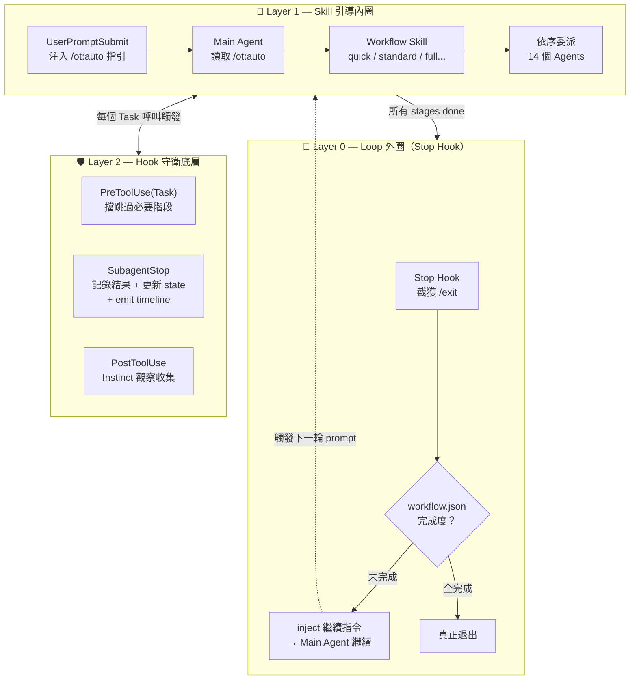
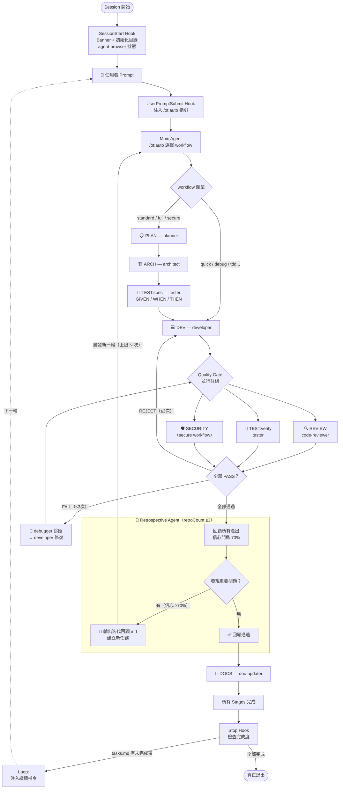
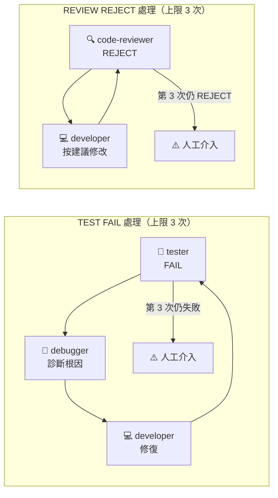

# Overtone 工作流架構圖

## 圖 1 — 三層架構全覽

```mermaid
flowchart TB
    subgraph L0["🔄 Layer 0 — Loop 外圈（Stop Hook）"]
        direction LR
        SH["Stop Hook\n截獲 /exit"]
        WC{"workflow.json\n完成度？"}
        CONT["inject 繼續指令\n→ Main Agent 繼續"]
        EXIT["真正退出"]
        SH --> WC
        WC -- "未完成" --> CONT
        WC -- "全完成" --> EXIT
    end

    subgraph L1["🎯 Layer 1 — Skill 引導內圈"]
        direction LR
        US["UserPromptSubmit\n注入 /ot:auto 指引"]
        MA["Main Agent\n讀取 /ot:auto"]
        WF["Workflow Skill\nquick / standard / full..."]
        AG["依序委派\n14 個 Agents"]
        US --> MA --> WF --> AG
    end

    subgraph L2["🛡️ Layer 2 — Hook 守衛底層"]
        direction LR
        PT["PreToolUse(Task)\n擋跳過必要階段"]
        SS["SubagentStop\n記錄結果 + 更新 state\n+ emit timeline"]
        PO["PostToolUse\nInstinct 觀察收集"]
    end

    CONT -.->|"觸發下一輪 prompt"| L1
    L1 <-->|"每個 Task 呼叫觸發"| L2
    L1 -->|"所有 stages done"| L0
```

---

## 圖 2 — Workflow 執行流程（含 Retrospective Agent）

```mermaid
flowchart TB
    START(["Session 開始"]) --> SS_HOOK["SessionStart Hook\nBanner + 初始化目錄\nagent-browser 狀態"]

    SS_HOOK --> PROMPT["👤 使用者 Prompt"]
    PROMPT --> US_HOOK["UserPromptSubmit Hook\n注入 /ot:auto 指引"]
    US_HOOK --> MAIN["Main Agent\n/ot:auto 選擇 workflow"]

    MAIN --> WFSEL{"workflow 類型"}

    WFSEL -->|"standard / full / secure"| PLAN["📋 PLAN — planner"]
    WFSEL -->|"quick / debug / tdd..."| DEV

    PLAN --> ARCH["🏗️ ARCH — architect"]
    ARCH --> TSPEC["🧪 TEST:spec — tester\nGIVEN / WHEN / THEN"]
    TSPEC --> DEV["💻 DEV — developer"]

    DEV --> QG{"Quality Gate\n並行群組"}
    QG --> REV["🔍 REVIEW\ncode-reviewer"]
    QG --> TEST["🧪 TEST:verify\ntester"]
    QG --> SEC["🛡️ SECURITY\n（secure workflow）"]

    REV & TEST & SEC --> PASS{"全部 PASS？"}

    PASS -->|"FAIL（≤3次）"| DBG["🔧 debugger 診斷\n→ developer 修復"]
    DBG --> QG

    PASS -->|"REJECT（≤3次）"| DEV
    PASS -->|"全部通過"| RETRO

    subgraph RETRO_BOX["🔁 Retrospective Agent（retroCount ≤3）"]
        RETRO["回顧所有產出\n信心門檻 70%"]
        RETRO --> RCHECK{"發現重要問題？"}
        RCHECK -->|"有（信心 ≥70%）"| ROUT["📝 輸出迭代回顧.md\n建立新任務"]
        RCHECK -->|"無"| RDONE["✅ 回顧通過"]
    end

    ROUT -->|"觸發新一輪（上限 N 次）"| MAIN
    RDONE --> DOCS["📝 DOCS — doc-updater"]

    DOCS --> ALL_DONE["所有 Stages 完成"]
    ALL_DONE --> STOP_HOOK["Stop Hook\n檢查完成度"]

    STOP_HOOK -->|"tasks.md 有未完成項"| LOOP["Loop:\n注入繼續指令"]
    STOP_HOOK -->|"全部完成"| REAL_EXIT(["真正退出"])

    LOOP -.->|"下一輪"| PROMPT
```

---

## 圖 3 — 失敗處理迴圈

```mermaid
flowchart LR
    subgraph FAIL_LOOP["TEST FAIL 處理（上限 3 次）"]
        T["🧪 tester\nFAIL"] --> D["🔧 debugger\n診斷根因"]
        D --> DEV2["💻 developer\n修復"]
        DEV2 --> T
        T -->|"第 3 次仍失敗"| HUMAN["⚠️ 人工介入"]
    end

    subgraph REJECT_LOOP["REVIEW REJECT 處理（上限 3 次）"]
        R["🔍 code-reviewer\nREJECT"] --> DEV3["💻 developer\n按建議修改"]
        DEV3 --> R
        R -->|"第 3 次仍 REJECT"| HUMAN2["⚠️ 人工介入"]
    end
```
