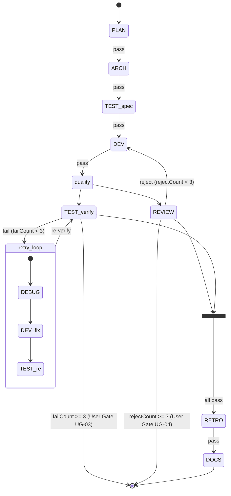

# Design: decision-point-index

## 技術摘要（What & Why）

- **方案**：純文件方案（Markdown）。`docs/spec/overtone-decision-points.md` 作為靜態索引，不引入程式化 registry。
- **理由**：此需求的核心是「人類可讀的控制流索引」，不是機器查詢。30 秒找到答案的目標靠文件結構和格式達成，不需要 JSON schema 或 health-check 整合。程式化 Registry 是 v2 範圍外工作。
- **取捨**：靜態文件無法自動同步，需靠慣例（修改 handler 時同步更新文件）維持一致性。接受此限制，因為決策點變動頻率低。

## 回答 Planner Open Questions

### Q1：User Gate entry 格式

統一格式如下（decision tree entry schema）：

```
#### [Gate ID]：[觸發情境名稱]

- **觸發條件**：[什麼情況下會問使用者]
- **觸發時機**：[workflow/stage 名稱] — [在哪個 hook/handler 觸發]
- **呈現方式**：[AskUserQuestion 選項列表 / 停止並顯示訊息]
- **Handler 位置**：`[檔案路徑]` L[行號]
- **使用者看到的選項**：
  - 選項 A：[做什麼]
  - 選項 B：[做什麼]
```

理由：PM SKILL.md 的 discovery gate 和 failure-handling.md 的「使用者介入」是不同性質——前者是「正常互動」（使用者決定方向），後者是「異常介入」（自動流程失敗）。兩者都用同一 schema，但用 `[呈現方式]` 欄位區分：discovery gate 填「AskUserQuestion 多選項」，failure gate 填「停止 Loop，顯示錯誤摘要並等待人工處理」。這樣 developer 一眼能判斷「這是設計中的互動」還是「這是錯誤處理路徑」。

### Q2：Mermaid 圖粒度

選擇「主幹 + 標注分支說明」方式：
- **主幹**：state node 為 stage（PLAN → ARCH → TEST:spec → DEV → REVIEW+TEST → RETRO → DOCS）
- **retry loop 以 subgraph 展示**：fail → debugger → developer → re-tester，用 subgraph retry 包圍，在圖外用文字說明重試上限（3 次）
- **理由**：完整畫出 retry loop 會讓圖寬到難以閱讀（尤其 reject loop 也要畫）。主幹 + subgraph 方式保留視覺層次，分支細節在下方表格中補充。

### Q3：佇列控制流定位

納入「自動決策索引」的獨立子節（不與其他自動決策混在一起），標題為「佇列控制流」。理由：佇列接續是 Stop hook 觸發的，屬於自動決策範疇，但邏輯特殊（依賴 queueCompleted + getNext 的組合），獨立子節比混在 loop 決策表格中更易理解。

## 文件結構設計

`docs/spec/overtone-decision-points.md` 分為 5 個頂層 Section：

```
# Overtone 控制流決策點索引

> 說明：本文件用途、版本

## 一、User Gate 索引
（人工介入點 — 何時問使用者）

### 1.1 Discovery 模式使用者確認
### 1.2 规劃模式（/ot:pm plan）確認
### 1.3 TEST FAIL 達到上限
### 1.4 REVIEW REJECT 達到上限
### 1.5 RETRO ISSUES 達到上限

## 二、自動決策索引
（hook 自動判斷 — 無需使用者介入）

### 2.1 PreToolUse(Task) 決策
（agent 委派前的阻擋 / 放行判斷）

### 2.2 SubagentStop 收斂決策
（agent 完成後的結果解析 + stage 轉場）

### 2.3 Stop hook 退出決策
（每輪 loop 結束的繼續 / 退出條件）

### 2.4 佇列控制流
（workflow 完成後是否啟動下一項）

## 三、Stage 轉場摘要
（18 個 workflow 的 stage 序列）

### 3.1 基本模板（5 個）
### 3.2 特化模板（7 個）
### 3.3 獨立 Agent 模板（3 個）
### 3.4 產品模板（3 個）
### 3.5 並行群組定義

## 四、Standard Workflow 狀態圖
（Mermaid 狀態轉移圖）

## 五、快速查找索引
（關鍵詞 → Section 對應表）
```

## 各 Section 內容格式規範

### Section 一：User Gate 索引

每個 Gate 使用上述 entry schema（Q1 回答的格式），以 `####` 標題開頭，包含 Gate ID（如 UG-01）。

Gate 總數（MVP 範圍）：
- UG-01：Discovery 模式使用者確認（PM SKILL.md，`/ot:pm` 觸發後選擇方向）
- UG-02：規劃模式佇列確認（PM SKILL.md，`/ot:pm plan` 關鍵字觸發）
- UG-03：TEST FAIL 上限（failure-handling.md，failCount >= 3）
- UG-04：REVIEW REJECT 上限（failure-handling.md，rejectCount >= 3）
- UG-05：RETRO ISSUES 上限（failure-handling.md，retroCount >= 3）

### Section 二：自動決策索引

2.1 - 2.2 用表格格式：

| 決策點 | 條件 | 結果 | Handler |
|--------|------|------|---------|

2.3 Stop hook 退出決策用有序清單（因為條件有優先順序）：
```
1. /ot:stop 手動退出 → exit
2. iteration >= 100 → exit + 警告
3. consecutiveErrors >= 3 → exit + 警告
4. allStagesCompleted + 含失敗 stage → abort
5. allStagesCompleted + 無失敗 → complete（→ 觸發佇列邏輯）
6. currentStage === PM → 不擋（PM 互動模式）
7. 其他（未完成）→ block + loop 繼續
```

2.4 佇列控制流用流程文字 + 條件表格。

### Section 三：Stage 轉場摘要

每個 workflow group 一個表格：

| Workflow | Key | Stages | 並行群組 |
|----------|-----|--------|----------|

Stage 序列用 `→` 連接，並行 stage 用 `[REVIEW+TEST]` 格式。

### Section 四：Mermaid 狀態圖



（developer 實作時依實際 mermaid 語法調整，以能正確渲染為準）

### Section 五：快速查找索引

兩欄表格：

| 查找情境 | 對應 Section |
|---------|-------------|
| 系統什麼時候會問使用者？ | 一、User Gate 索引 |
| discovery workflow 什麼時候暫停？ | 一、UG-01 |
| REVIEW REJECT 後系統做什麼？ | 二、2.2 SubagentStop 收斂 |
| Loop 什麼時候退出？ | 二、2.3 Stop hook 退出決策 |
| standard workflow 有哪些 stages？ | 三、3.1 基本模板 |
| 完整狀態轉移圖（含 retry）？ | 四、Standard Workflow 狀態圖 |
| 佇列完成後系統做什麼？ | 二、2.4 佇列控制流 |

## 檔案結構

```
新增的檔案：
  docs/spec/overtone-decision-points.md    <- 新建：控制流決策點索引

修改的檔案：
  docs/spec/overtone.md                    <- 在文件索引加入 overtone-decision-points.md 引用
```

不需要任何程式碼變更、不需要新增測試（純文件任務）。

## 實作注意事項

給 developer 的提醒：

1. **資料來源對照**：
   - workflows 完整清單：`plugins/overtone/scripts/lib/registry.js` L46-72
   - parallelGroupDefs：`plugins/overtone/scripts/lib/registry.js` L76-80
   - Stop hook 退出條件優先順序：`plugins/overtone/scripts/lib/session-stop-handler.js` L152-220
   - PreToolUse 阻擋邏輯：`plugins/overtone/scripts/lib/pre-task-handler.js` L142-172
   - SubagentStop 收斂邏輯：`plugins/overtone/scripts/lib/agent-stop-handler.js` L100-138
   - User Gate UG-01/02：`plugins/overtone/skills/pm/SKILL.md` L84-113
   - User Gate UG-03/04/05：`plugins/overtone/skills/workflow-core/references/failure-handling.md` L31-125

2. **Mermaid 語法**：使用 `stateDiagram-v2`，用 `<<fork>>` / `<<join>>` 表示並行分叉，subgraph 表示 retry loop。以 GitHub 可渲染為驗收標準。

3. **overtone.md 更新位置**：找到「子文件」或「核心文件索引」的表格，新增一行：
   - 文件：`docs/spec/overtone-decision-points.md`
   - 用途：控制流決策點索引（User Gate / 自動決策 / Stage 轉場 / 狀態圖）
   - 讀取時機：新功能設計前、理解控制流時

4. **PM 特殊處理**：session-stop-handler.js L228-239 有 PM 互動模式特例（nextStage === 'PM' 時直接 return，不阻擋也不 loop），這個決策點要納入 2.3 的優先順序清單（插入在「佇列/完成」之後、「未完成 → loop 繼續」之前）。

5. **SubagentStop PM Queue 特例**：agent-stop-handler.js L178-188 的 PM stage 完成後自動解析佇列表格並寫入 execution-queue，這屬於 2.4 佇列控制流的前置步驟，需在 2.4 中描述。
